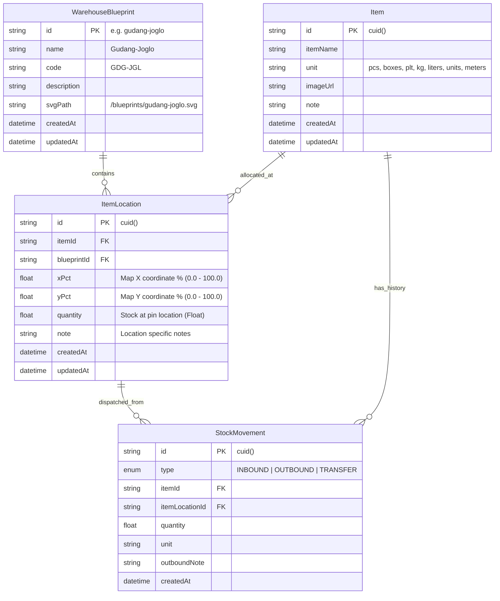

# Data Models & Database Architecture (Inventori Gudang)

This document provides a comprehensive overview of the data models, database schema, and relational architecture for the **Inventori Gudang** application.

---

## 1. Overview & Database Architecture

The system utilizes **Prisma 7 ORM** backed by a **Neon PostgreSQL** database (with WebSocket driver adapter `@prisma/adapter-neon`).

The domain revolves around tracking inventory stock quantities across physical warehouse facilities using interactive SVG floorplan map coordinates `(xPct, yPct)`.



---

## 2. Model Specifications

### 2.1 `WarehouseBlueprint` (Master Data)
Defines physical warehouse facilities and their SVG floorplan map reference.

| Field | Type | Attributes | Description |
| :--- | :--- | :--- | :--- |
| `id` | `String` | `@id` | Unique ID (e.g. `"gudang-joglo"`, `"gudang-selatan"`) |
| `name` | `String` | | Display name (e.g. `"Gudang-Joglo"`) |
| `code` | `String` | `@unique` | Facility code (e.g. `"GDG-JGL"`) |
| `description` | `String?` | | Facility description and zone details |
| `svgPath` | `String` | | Path to SVG floorplan asset (e.g. `"/blueprints/gudang-joglo.svg"`) |
| `createdAt` | `DateTime` | `@default(now())` | Record creation timestamp |
| `updatedAt` | `DateTime` | `@updatedAt` | Last modification timestamp |

### 2.2 `Item` (Master Catalog)
Stores catalog item details and default units.

| Field | Type | Attributes | Description |
| :--- | :--- | :--- | :--- |
| `id` | `String` | `@id @default(cuid())` | Primary key (CUID) |
| `itemName` | `String` | | Name of the inventory item |
| `unit` | `String` | `@default("pcs")` | Standard quantity unit (`pcs`, `boxes`, `plt`, `kg`, `liters`, `units`, `meters`) |
| `imageUrl` | `String?` | | Image preview URL or base64 data |
| `note` | `String?` | | General description or batch notes |
| `createdAt` | `DateTime` | `@default(now())` | Record creation timestamp |
| `updatedAt` | `DateTime` | `@updatedAt` | Last modification timestamp |

### 2.3 `ItemLocation` (Stock Allocation & Coordinates)
Maps stock quantity of an item to exact percentage coordinates on a warehouse blueprint floorplan.

| Field | Type | Attributes | Description |
| :--- | :--- | :--- | :--- |
| `id` | `String` | `@id @default(cuid())` | Primary key (CUID) |
| `itemId` | `String` | `FK -> Item.id` | Reference to target Item (Cascade delete) |
| `blueprintId` | `String` | `FK -> WarehouseBlueprint.id` | Reference to target Warehouse Blueprint |
| `xPct` | `Float` | | Horizontal coordinate percentage (0.0 to 100.0) |
| `yPct` | `Float` | | Vertical coordinate percentage (0.0 to 100.0) |
| `quantity` | `Float` | `@default(0)` | Current available stock quantity at this coordinate pin |
| `note` | `String?` | | Location-specific storage note |
| `createdAt` | `DateTime` | `@default(now())` | Creation timestamp |
| `updatedAt` | `DateTime` | `@updatedAt` | Last modification timestamp |

> [!NOTE]
> Stock quantity zero (`quantity = 0`) is preserved in `ItemLocation` records to support historical traceability.

### 2.4 `StockMovement` (Transaction & Audit Log)
Records all stock inbound, outbound dispatches, and transfers.

| Field | Type | Attributes | Description |
| :--- | :--- | :--- | :--- |
| `id` | `String` | `@id @default(cuid())` | Primary key (CUID) |
| `type` | `MovementType` | `@default(OUTBOUND)` | Enum: `INBOUND`, `OUTBOUND`, `TRANSFER` |
| `itemId` | `String` | `FK -> Item.id` | Target Item ID |
| `itemLocationId`| `String` | `FK -> ItemLocation.id` | Connected pin location ID |
| `quantity` | `Float` | | Amount dispatched/moved |
| `unit` | `String` | | Unit used at transaction time |
| `note` | `String?` | | Item movement's extra detail |
| `createdAt` | `DateTime` | `@default(now())` | Transaction timestamp |

---

## 3. Database Commands & Seeding

- **Schema push**:
  ```bash
  npm run db:push
  ```
- **Generate Prisma Client**:
  ```bash
  npm run db:generate
  ```
- **Seed database master data**:
  ```bash
  npm run db:seed
  ```
- **Open Prisma Studio UI**:
  ```bash
  npm run db:studio
  ```
